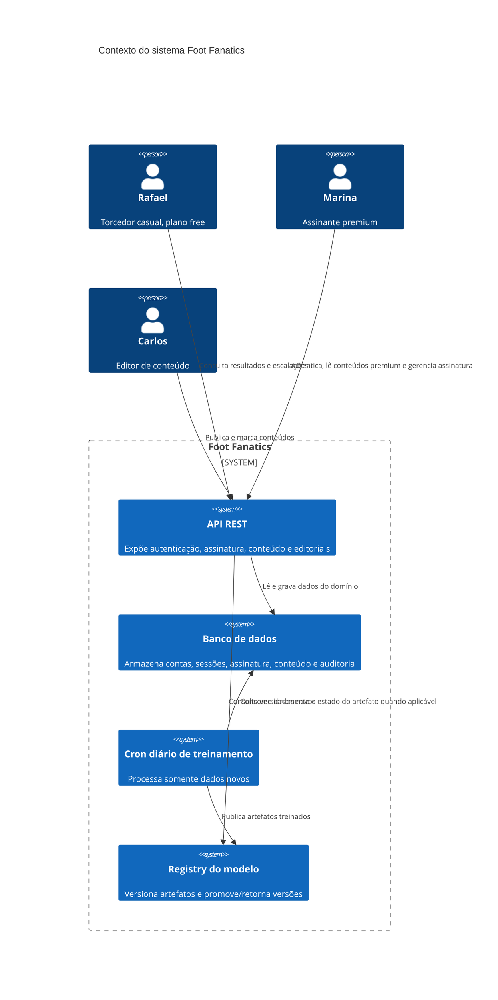
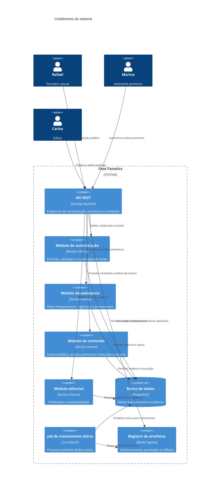
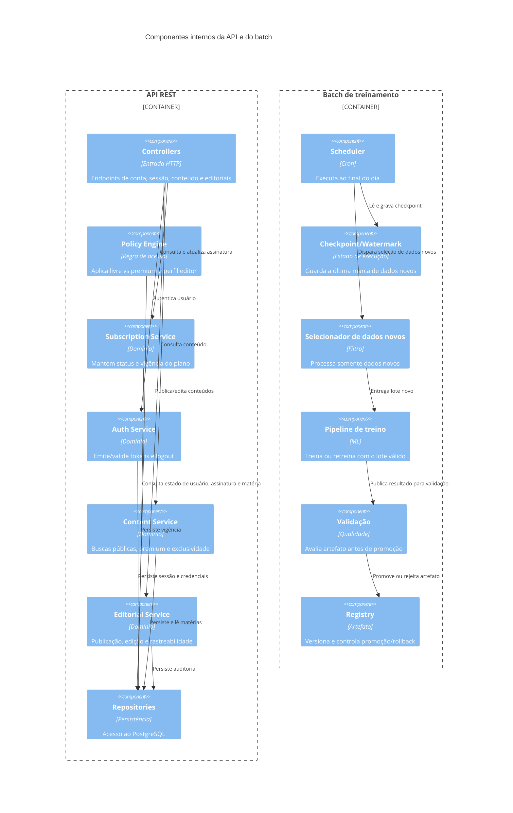
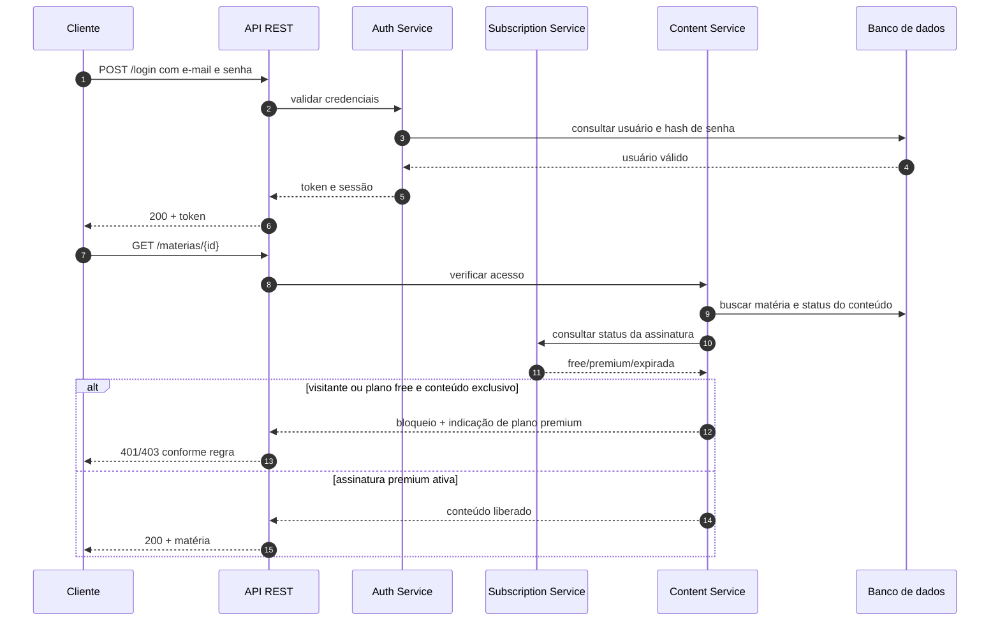
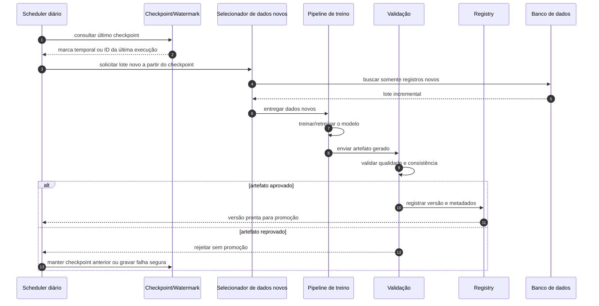

# Foot Fanatics — Arquitetura

## 0. Contexto e objetivo

Esta seção consolida a fonte documental vigente do projeto: [README.md](README.md), [docs/prd.md](prd.md), [docs/plano-de-teste.md](plano-de-teste.md) e [AGENTS.md](../AGENTS.md). A documentação de requisitos em [docs/prd.md](prd.md) é a base de verdade para personas, escopos, requisitos funcionais (RF-01 a RF-17), requisitos não funcionais (RNF-01 a RNF-12) e pontos de validação explícitos. O sistema descrito é uma API REST de conteúdo esportivo com públicos free e premium, gestão de autenticação, sessão, assinatura e publicação editorial.

O objetivo arquiteturalmente relevante é suportar a diferenciação entre acesso público, assinatura premium e publicação por editor, preservando segurança, rastreabilidade e disponibilidade do conteúdo. A arquitetura deve atender ao comportamento já declarado sem inventar usuários, volumes, integrações de pagamento reais, regras de SLA ou tecnologias fora do conjunto explícito do projeto.

### Restrição operacional obrigatória

Existe um cron job executado diariamente ao final do dia para treinar ou retreinar usando somente dados novos. Essa restrição deve ser tratada como requisito de operação e arquitetura, independentemente da implementação tecnológica adotada.

## 1. Stakeholders e personas

| Papel | Descrição | Evidência | Observação arquitetural |
| --- | --- | --- | --- |
| Rafael | Torcedor casual, plano free, acessa via celular, sem cadastro/login para leitura pública. | [docs/prd.md](prd.md) §3.1 | Requer baixo atrito de acesso público e bloqueio claro de conteúdo exclusivo. |
| Marina | Torcedora assinante premium, usa notebook/celular/tablet, exige sessão contínua e acesso sem reautenticação excessiva. | [docs/prd.md](prd.md) §3.2 | Impõe requisitos de autenticação, sessão, vigência e consistência premium. |
| Carlos | Editor de conteúdo da operação, publica e marca conteúdos como públicos ou exclusivos. | [docs/prd.md](prd.md) §3.3 | Exige autorização por perfil, rastreabilidade e marcação consistente de conteúdo. |
| Projeto/Disciplina | Contexto de desenvolvimento acadêmico, com foco em qualidade de software e requisitos verificáveis. | [README.md](README.md); [docs/plano-de-teste.md](plano-de-teste.md) | Define a necessidade de critérios de teste e evidência objetiva. |

## 2. Requisitos arquiteturalmente significativos

Os itens abaixo foram extraídos de [docs/prd.md](prd.md) e devem ser considerados requisitos de arquitetura/implementação, não apenas de negócio:

- RF-01, RF-02: cadastro com e-mail e senha; validação de e-mail e exclusão de duplicidade.
- RF-04: distinção entre perfis de acesso torcedor e editor.
- RF-05, RF-06, RF-07, RF-08: autenticação por e-mail/senha, emissão de token, invalidação no logout, rejeição de token expirado/inválido e suporte a sessões simultâneas em diferentes dispositivos.
- RF-09, RF-10, RF-11, RF-12: plano free por default, contratação do plano premium sem pagamento real, vigência e cancelamento com acesso até o fim do período contratado.
- RF-13, RF-14, RF-15: leitura pública sem login; negação de acesso a conteúdo exclusivo para visitante e free; liberação para premium ativo.
- RF-16, RF-17: publicação/editoria com marcação pública ou exclusiva; restrição de publicação e edição ao perfil editor.
- RNF-01, RNF-04, RNF-08, RNF-12: segurança, 401/403 padronizados, senhas em hash, ausência de token em logs e rastreabilidade de publicações.
- RNF-02, RNF-03, RNF-05, RNF-06, RNF-07, RNF-09, RNF-10, RNF-11: desempenho, expiração de sessão, vigência premium, bloqueio rápido de conteúdo e disponibilidade.

### Restrições relevantes

- O escopo explícito exclui pagamento real, painel administrativo e mobile nativo. Consulte [docs/prd.md](prd.md) §5.
- A restrição do cron job diário aponta para um fluxo operacional de treinamento/retraining que usa somente dados novos, sem acrescentar ou reutilizar dados antigos fora do conjunto novo.

## 3. Atributos de qualidade

| Atributo | Evidência documental | Como impacta a arquitetura |
| --- | --- | --- |
| Segurança | RNF-01, RNF-04, RF-07, RF-17 | Hash de senhas, validade/expiração de tokens, bloqueio de acesso indevido e ausência de token em logs. |
| Confiabilidade da sessão | RNF-03, RF-05, RF-06, RF-08 | Sessões devem ser consistentes com expiração sem quebrar uso em múltiplos dispositivos. |
| Integridade do conteúdo | RF-14, RF-15, RF-16, RNF-09, RNF-12 | Regras de publicação e bloqueio não podem permitir vazamento entre conteúdo público e exclusivo. |
| Desempenho percebido | RNF-02, RNF-06, RNF-07, RNF-10 | Leitura pública e bloqueio de conteúdo devem responder rapidamente em condições de uso móvel e simultaneidade. |
| Disponibilidade | RNF-11 | O serviço deve manter disponibilidade compatível com health check periódico. |
| Rastreabilidade | RNF-12, RF-16, RF-17 | Publicações e mudanças de marcação precisam registrar quem alterou e quando. |

## 4. Drivers priorizados

| Driver | Descrição | Origem |
| --- | --- | --- |
| D1. Acesso seguro e consistente | Autenticação, sessão, expiração, logout e rejeição de tokens inválidos são centrais para o cenário de Marina. | [docs/prd.md](prd.md) §3.2; RF-05 a RF-08; RNF-01 a RNF-04 |
| D2. Conteúdo público vs premium | O sistema precisa distinguir conteúdo público de exclusivo sem vazamento nem bloqueio indevido. | [docs/prd.md](prd.md) §3.1; RF-13 a RF-15; RNF-06, RNF-07, RNF-09 |
| D3. Gestão de assinatura e vigência | The app must handle free and premium plans, valid expiration, and cancellation with continued access until period end. | [docs/prd.md](prd.md) §3.2; RF-09 a RF-12; RNF-05 |
| D4. Publicação editorial com autorização | A publicação e a edição de matérias devem ser segregadas por perfil editor e rastreáveis. | [docs/prd.md](prd.md) §3.3; RF-16, RF-17; RNF-08, RNF-12 |
| D5. Treinamento incremental diário | O cron job diário no final do dia treina ou retreina somente com dados novos. | Requisito explícito do analista/arquitetura atual; restrição operacional obrigatória |

## 5. Glossário

- Conteúdo público: material acessível sem login e sem necessidade de assinatura.
- Conteúdo exclusivo: matéria sinalizada como disponível apenas para assinantes premium.
- Plano free: perfil inicial atribuído a toda nova conta; conforme RF-09.
- Plano premium: contratação autenticada sem pagamento real; conforme RF-10.
- Vigência da assinatura: intervalo de validade da assinatura ativa; conforme RF-11 e RNF-05.
- Sessão: contexto autenticado mantido por token, com expiração e invalidação por logout; conforme RF-05 a RF-08.
- Editor: perfil com autorização para publicar e editar matérias; conforme RF-16 e RF-17.
- p95: porcentil 95, usado em RNF-02, RNF-06 e RNF-07 para indicar desempenho.
- Cron job de treinamento: rotina diária final do dia que treina/retreina com somente dados novos.

## 6. Riscos iniciais

- Ambiguidade de regra de negócio: RF-08 não define limite de dispositivos simultâneos; isso pode afetar a política de sessão e de token.
- Ambiguidade de cancelamento: RF-12 indica que o cancelamento mantém o acesso até o fim do período já contratado; a regra precisa ser validada no detalhe do contrato de vigência.
- Falta de decisão explícita de dados de treinamento: o cron job diário exige uso somente de dados novos, mas o projeto não detalha modelo, origem, armazenamento, retenção, rastreio ou estratégia de retreinamento.
- Falta de definição de política de auditoria detalhada: RF-12 menciona rastreio de publicações, mas não especifica tabela, campos, retenção ou eventos mínimos.
- Conteúdo exclusivo e dados de assinatura dependem de consistência entre estados de publicação, perfil de usuário e vigência de assinatura; qualquer atraso pode gerar vazamento ou bloqueio indevido.

## 7. Fatos, lacunas, conflitos, suposições e perguntas abertas

### Fatos confirmados

- O sistema é uma API REST de conteúdo esportivo com clubes, jogos, resultados, escalações e matérias; conforme [README.md](README.md) e [docs/prd.md](prd.md).
- Há três personas principais com necessidades distintas: Rafael, Marina e Carlos; conforme [docs/prd.md](prd.md) §3.
- O produto possui claramente escopos E1 a E4 e fora de escopo explícito; conforme [docs/prd.md](prd.md) §4 e §5.
- As regras de autenticação, sessão, assinatura, conteúdo e autorização estão documentadas em RF-01 a RF-17 e RNF-01 a RNF-12; conforme [docs/prd.md](prd.md).
- O projeto inclui documentação de qualidade em [docs/plano-de-teste.md](plano-de-teste.md) e orientações do ambiente em [AGENTS.md](../AGENTS.md).

### Lacunas

- Não há modelo de dados explícito em [docs/prd.md](prd.md), [README.md](README.md) ou [docs/arquitetura.md](arquitetura.md).
- Não há definição de endpoints, entidades, integrações ou componentes do sistema além do stack geral e do domínio funcional.
- Não há resposta formal sobre a política de dispositivos simultâneos mencionada em RF-08.
- Não há regra operacional detalhada para o cron job de treinamento diário com dados novos (origem, persistência, retenção, validação, rollback etc.).

### Conflitos/contradições

- O PRD sinaliza que o público pode acessar resultados e escalações sem login (RF-13), mas também define bloqueio para conteúdo exclusivo e assinatura premium (RF-14 e RF-15). A arquitetura precisa distinguir claramente o tipo de dado e o perfil de acesso antes do retorno.
- O conteúdo é tratado como público e exclusivo, mas o documento não define um critério formal de marcação que elimine ambiguidades de negócio em casos de conflito entre estado publicado e status da assinatura.
- O cron job com dados novos é uma restrição operacional, mas não há definição de como esse fluxo interage com o modelo de dados já existente nem com o ciclo de treinamento com base incremental.

### Suposições que não devem ser tratadas como requisitos

- Não se assume que existem dashboards administrativos, pagamentos reais, push notifications, app mobile nativo ou integrações externas sem suporte no PRD.
- Não se assume que o cron job utilize IA, ML, modelos específicos, pipelines externos, volumes ou prazos além do enunciado de execução diária ao final do dia com dados novos.

### Perguntas abertas

- Qual é a política de limite de dispositivos simultâneos para a mesma conta, caso exista?
- Qual é a semântica exata de “cancelamento” em relação à vigência e ao acesso até o fim do período contratado?
- Como o estado “conteúdo exclusivo” será representado no modelo de dados e validado no serviço de leitura?
- Quais entidades e campos compõem o rastreio de publicações e marcação de exclusividade?
- Qual é a origem, a persistência e a validação do conjunto de dados novos usado pelo cron job diário de treinamento/retreinamento?

## 8. Decisões e estado atual

- A base documental atual já estabelece as personas, os escopos e os requisitos funcionais e não funcionais relevantes para arquitetura.
- O projeto ainda não definiu, em [docs/arquitetura.md](docs/arquitetura.md), a modelagem detalhada de camadas, modelo de dados, autenticação e sessão, nem ADRs específicos. Esse documento atua como base inicial para essa formalização futura.

## 9. Visão de solução e responsabilidades

### 9.1 Visão de alto nível

A solução é organizada em duas frentes de execução que compartilham a mesma base de dados e o mesmo domínio de conteúdo esportivo:

1. Fluxo online: API REST que atende Rafael, Marina e Carlos, aplicando autenticação, sessão, assinatura, autorização e publicação/editoria.
2. Fluxo batch: cron diário no fim do dia, responsável por treinar ou retreinar usando somente dados novos, sem reutilizar dados antigos fora do conjunto novo.

Essa separação é necessária para respeitar os atributos de qualidade de segurança, integridade do conteúdo, desempenho percebido e rastreabilidade indicados em [docs/prd.md](docs/prd.md) e pela restrição operacional do cron diário.

### 9.2 Responsabilidades por fronteira

| Fronteira | Responsabilidade principal | Limites explícitos | Base em requisito/atributo |
| --- | --- | --- | --- |
| API REST | Receber requisições do cliente, orquestrar autenticação e autorização, expor conteúdo público e premium, e permitir operações editoriais. | Não cobre gestão financeira real, painel administrativo nem mobile nativo. | RF-01 a RF-17; RNF-02, RNF-06, RNF-07, RNF-08, RNF-11 |
| Autenticação e sessão | Validar credenciais, emitir e invalidar token, controlar expiração e permitir sessões simultâneas em múltiplos dispositivos. | Não deve gravar tokens em log nem exigir reautenticação indevida. | RF-05 a RF-08; RNF-01, RNF-03, RNF-04 |
| Gestão de assinatura | Manter plano free e premium, vigência, cancelamento e acesso até o fim do período contratado. | Sem integração com pagamento real. | RF-09 a RF-12; RNF-05 |
| Conteúdo e autorização | Determinar leitura pública x privada, bloquear conteúdo exclusivo para visitante/free e liberar para premium ativo. | Não deve permitir vazamento entre público e exclusivo. | RF-13 a RF-15; RNF-06, RNF-07, RNF-09 |
| Edição editorial | Publicar e atualizar matérias com marcação pública ou exclusiva, registrando usuário e timestamp. | Só editor pode publicar/editar; sem papel de administração. | RF-16, RF-17; RNF-08, RNF-12 |
| Batch de treinamento diário | Selecionar somente dados novos, realizar retreinamento e persistir checkpoint/estado do job. | Não pode reusar dados antigos no lote atual sem documentação explícita. | Restrição operacional obrigatória e D5 |
| Persistência | Armazenar contas, sessões, assinatura, conteúdo e auditoria da publicação. | Não deve armazenar senhas em texto puro. | RF-01 a RF-17; RNF-01, RNF-12 |

### 9.3 Limites da solução

- Não há requisito de pagamento real, mobile nativo, push notification, dashboard administrativo ou integração externa de terceiros. Isso está explícito em [docs/prd.md](docs/prd.md) §5.
- Não há requisito de limite de dispositivos simultâneos para a mesma conta; isso permanece como ponto de decisão pendente, não como premissa arquitetural.
- Não há requisito de tamanho de base, volume de conteúdo, pico de operação ou SLA explícito. Portanto, a arquitetura deve seguir um desenho modular e mensurável, mas sem afirmar valores fora do PRD.
- Não há definição formal de modelo de ML, algoritmo, fonte de dados ou frequência exata além do cron diário ao final do dia e processamento de dados novos.

### 9.4 Interfaces importantes

| Interface | Operação | Provedor | Consumidor | Observação |
| --- | --- | --- | --- | --- |
| I-01 | cadastro e autenticação | API REST | cliente/torcedor | base em RF-01, RF-02, RF-05 |
| I-02 | emissão e validação de sessão | Autenticação e sessão | API REST | base em RF-05, RF-06, RF-07, RNF-03, RNF-04 |
| I-03 | leitura de conteúdo | Conteúdo e autorização | cliente/torcedor | base em RF-13, RF-14, RF-15, RNF-06, RNF-07 |
| I-04 | publicação de matéria | Edição editorial | editor | base em RF-16, RF-17, RNF-08 |
| I-05 | consulta de vigência | Gestão de assinatura | Conteúdo e autorização | base em RF-11, RF-12, RNF-05 |
| I-06 | seleção de dados novos | Batch de treinamento | Persistência/warehouse/fluxo de dados | construída a partir da restrição operacional do cron diário |
| I-07 | registro de artefato/modelo | Batch de treinamento | Registry/modelo | decisão de arquitetura sem requisito explícito, marcada como tal |
| I-08 | promoção/rollback | Registry/modelo | produção online | decisão de arquitetura sem requisito explícito, marcada como tal |

## 10. Diagramas C4

### 10.1 Contexto



### 10.2 Contêineres



### 10.3 Componentes



## 11. Fluxos de sequência

### 11.1 Fluxo online: login e leitura premium



### 11.2 Fluxo batch: cron diário com dados novos



## 12. Modelo do cron diário: dados novos, checkpoint e operação segura

### 12.1 Regras de operação

A restrição operacional obrigatória exige que o cron diário processe somente dados novos e que treine ou retreine sem acrescentar dados antigos ao lote corrente. Para isso, a arquitetura deve definir um mecanismo explícito de seleção incremental com checkpoint persistido. A decisão é justificada pela restrição operativa e pelo driver D5, sem inventar dados de volume ou tecnologia.

### 12.2 Watermark/checkpoint

| Decisão | Justificativa | Base | Status |
| --- | --- | --- | --- |
| Persistir um watermark por execução do cron | Evita reprocessar o mesmo conjunto de dados e permite progresso incremental diário. | Restrição operacional do cron diário; D5; RNF-12 para rastreabilidade | Requisito explícito |
| Armazenar marcador de última execução e, se aplicável, último identificador/instante processado | Permite processamento de dados novos sem depende de recálculo completo. | Restrição operacional do cron diário | Requisito explícito |
| Registrar o checkpoint junto à linhagem do lote | Facilita auditoria e recuperação em caso de falha. | RNF-12; atributo de rastreabilidade | Requisito explícito |

### 12.3 Idempotência e concorrência

| Decisão | Justificativa | Base | Status |
| --- | --- | --- | --- |
| O job deve ser idempotente por lote e por execução | Evita duplicação de artefatos, reprocessamento ou sobrescrita acidental. | RNF-12 e atributo de integridade; restrição operacional do cron | Requisito indireto |
| O sistema deve impedir duas execuções concorrentes do mesmo cron para a mesma janela temporal | Evita inconsistência ou seleção duplicada de dados novos. | D5; atributo de confiabilidade | Requisito indireto |
| A execução em falha deve repetir apenas o lote falho, não reprocessar o lote já confirmado | Preserva consistência e reduz custo. | D5; atributo de qualidade operacional | Requisito indireto |

### 12.4 Retry, recuperação e qualidade

| Decisão | Justificativa | Base | Status |
| --- | --- | --- | --- |
| Dividir a execução em etapas com checkpoint intermediário | Permite recuperação sem recomeçar do início. | D5; atributo de confiabilidade | Requisito indireto |
| Reaproveitar estados de sucesso anteriores e rejeitar apenas a etapa falha | Mantém integridade e reduz retrabalho. | D5; atributo de disponibilidade | Requisito indireto |
| Validar a qualidade do lote antes de promocionar artefato | Protege a consistência do sistema mesmo quando o treino é executado diuturnamente. | RNF-11; qualidade geral e integridade | Requisito indireto |
| Registrar linhagem do lote, dos dados e do modelo produzido | Reforça rastreabilidade e diagnósticos de regressão. | RNF-12; atributo de rastreabilidade | Requisito explícito |

### 12.5 Reprodutibilidade, versionamento e promoção

| Decisão | Justificativa | Base | Status |
| --- | --- | --- | --- |
| Capturar configuração da execução e hash do lote de entrada | Garante reprodutibilidade básica e diagnóstico em caso de regressão. | D5; atributo de rastreabilidade | Sem requisito explícito; decisão técnica defensável |
| Manter versionamento de artefatos e metadados | Permite comparar treinamentos, promover uma versão e recuperar uma anterior. | RNF-12; atributo de rastreabilidade | Requisito indireto |
| Definir critérios explícitos para promoção e rollback | Evita promoção automática de artefato sem validação. | Atributos de qualidade e segurança; ausência de regra explícita | Sem requisito explícito; decisão de arquitetura |
| Manter rollback de versão anterior para cenários de regressão | Reduz impacto de erro em operação. | Atributos de qualidade e disponibilidade | Sem requisito explícito; decisão de arquitetura |

## 13. Suposições, alternativas e decisões sem requisito

### 13.1 Suposições que devem permanecer explícitas

- O cron diário trabalha no mesmo domínio funcional da aplicação; a modelagem exata do conjunto de dados novos não foi definida no PRD e, portanto, não deve ser assumida como requisito.
- O processo de treinamento ou retreinamento pode ocorrer em uma etapa separada da API, sem necessidade de alterar os requisitos de login, sessão e assinatura.
- A seleção de “dados novos” será feita por um identificador temporal/operacional ou por outra marca de progresso, mas o projeto não definiu a forma exata.
- O sistema pode manter artefatos versionados, mas não há requisito de uso específico de registry, MLOps ou plataforma de ML no projeto.

### 13.2 Alternativas arquiteturais consideradas

| Alternativa | Vantagem | Desvantagem | Decisão |
| --- | --- | --- | --- |
| Treinar no mesmo banco de dados da aplicação | Simplicidade operacional e menos componente novo | Acopla processamento e transação, aumenta risco para produção | Não recomendado sem requisito explícito |
| Treinar em fluxo separado, com lote incremental diário | Isola carga do online e respeita cron final do dia | Exige checkpoint, registries e observabilidade | Alternativa preferível |
| Reprocessar tudo a cada dia | Simples de conceber | Viola a restrição de usar somente dados novos e aumenta custo/tempo | Rejeitada |
| Promover artefato sem validação formal | Rapidez | Perigo de regressão e ausência de rastreabilidade | Rejeitada |

### 13.3 Decisões sem requisito documentado

- Uso de um registry central de artefatos e metadados de treinamento.
- Política formal de promoção/rollback de artefatos.
- Critério quantitativo para aprovação do artefato antes da promoção.
- Armazenamento explícito de checkpoint e linhagem do lote em uma tabela de controle.

Essas decisões são arquiteturalmente defensáveis, mas não têm base textual direta em [docs/prd.md](docs/prd.md). Elas devem ser tratadas como escolhas de implementação e não como requisitos de negócio.

## 14. Observabilidade, segurança, LGPD e custos

### 14.1 Observabilidade

- Logs devem registrar eventos de execução do cron, falha de seleção, checkpoint, promoção e rollback, sem expor tokens. Isso atende RNF-04 e o atributo de rastreabilidade.
- Métricas de execução diária devem permitir distinguir sucesso, falha, rejeição por qualidade, reprocessamento e lock de concorrência.
- O monitoramento deve ser desdobrado em três níveis: execução do job, qualidade do lote e estado do artefato.

### 14.2 Segurança e LGPD

- Senhas e credenciais não podem ser armazenadas em texto puro; isso é explicitado em RNF-01.
- Tokens não devem aparecer em logs, conforme RNF-04.
- Qualquer dado sensível ou potencialmente identificável deve ser minimizado e tratado conforme a regra de negócio e os limites de escopo do projeto; o PRD não detalha a categoria de dados, portanto, a arquitetura deve manter uma política de minimização e não assumir mais dados do que os necessários.
- O cron de treinamento deve operar somente com dados novos e com registro explícito de origem, para facilitar auditoria e eventual exigência de dados pessoais.

### 14.3 Custos

- O processamento diário incremental reduz custo em comparação com reprocessamento completo, e é consistente com a restrição de dados novos.
- A arquitetura deve favorecer um pipeline que só carregue, valide e treine o lote novo, em vez de repetir tudo cada dia.
- Decisões de versionamento, checkpoint e rollback devem reduzir retrabalho, mas esse ganho é arquitetural e não foi transformado em requisito de volume ou SLA.

## 15. Conclusão da arquitetura inicial

A arquitetura atual pode ser definida em termos de fronteiras bem separadas:

- online para usuários e operação do conteúdo;
- batch para cron diário incremental;
- persistência transacional para estado do sistema;
- rastreabilidade e versionamento para artefatos e feeds de operação.

Essa estrutura respeita os requisitos explícitos de [docs/prd.md](docs/prd.md), os atributos de qualidade do projeto e a restrição operacional do cron diário, sem introduzir tecnologia, volume ou regra não documentados.

## 16. Rastreabilidade de decisões

| Decisão | Fonte textual | Classificação |
| --- | --- | --- |
| API REST como exposição online | [README.md](README.md); [docs/prd.md](docs/prd.md) | Requisito documental |
| Login, sessão e expiração | RF-05 a RF-08; RNF-03, RNF-04 | Requisito documental |
| Plano free/premium e vigência | RF-09 a RF-12; RNF-05 | Requisito documental |
| Conteúdo público x exclusivo | RF-13 a RF-15; RNF-06, RNF-07, RNF-09 | Requisito documental |
| Edição editorial e perfil de editor | RF-16, RF-17; RNF-08, RNF-12 | Requisito documental |
| Cron diário usando dados novos | restrição operacional obrigatória do analista/arquitetura | Requisito operacional |
| Watermark/checkpoint incremental | inferência direta da restrição de dados novos | Requisito operacional |
| Registry/versionamento do artefato | decisão de arquitetura sem requisito explícito | Sem requisito documental |
| Promoção e rollback | decisão de arquitetura sem requisito explícito | Sem requisito documental |

## 17. Estado da documentação

O documento de arquitetura já contempla contexto, objetivos, stakeholders, personas, requisitos significativos, atributos de qualidade, drivers, limitações, alternativas, diagramas C4 e detalhes de operação do cron. O que permanece pendente é a definição formal do modelo de dados e das decisões de implementação específicas em banco, autenticação e treinos, as quais ainda não existem como requisito textual no repositório aberto.

## 18. Painel revisor independente (ATAM + arquitetura + dados/ML + segurança/LGPD + SRE + custos)

### 18.1 Visão do painel

O painel foi formado por papéis com visão crítica sobre a mesma base documental: [docs/prd.md](docs/prd.md), [docs/plano-de-teste.md](docs/plano-de-teste.md), [README.md](README.md) e [docs/arquitetura.md](docs/arquitetura.md). O objetivo foi verificar coerência entre a visão funcional, a arquitetura, o fluxo online, o fluxo batch e a análise de risco, sem transformar hipótese em requisito.

O painel conclui que a arquitetura atual é coerente com a evidência existente, mas que há áreas críticas em que a arquitetura ainda depende de decisões de implementação a serem formalizadas antes da execução real. Essas decisões não são requisitos de negócio por si só; são requisitos de engenharia, operação e governança.

### 18.2 Objeções por papel

#### 18.2.1 Arquiteto de solução

Objeção principal: a arquitetura separa o fluxo online e o fluxo batch, mas ainda não explicita a interface de estado entre o serviço de conteúdo e o lote de treinamento. A regra “dados novos apenas” exige controle de sincronização e ponta de consistência entre base operacional e base de processamento. Sem isso, a arquitetura pode ficar correta em desenho, mas frágil em operação real.

Fundamentação:

- Coerência com C4 e sequência: a separação existe, mas a fronteira entre dados novos e pipeline de treino ainda é uma decisão de implementação.
- Risco: revisão de checkpoint inconsistente, duplicação de lote ou reprocessamento acidental.
- Correção: exigir explicitamente watermark, checkpoint, estado de execução e outlet de falhas separadas.

#### 18.2.2 Especialista em dados/ML

Objeção principal: a arquitetura menciona treinamento e retreinamento, mas ainda não define critérios de qualidade nem forma de validação do artefato antes da promoção. Isso torna o batch vulnerável a “candidate worst” e a artefato de baixa qualidade promovido sem sinalização clara.

Fundamentação:

- O cron diário existe, mas a documentação não define a regra de qualidade mínima nem a forma de comparar versões.
- O pipeline de treino e o registry aparecem como decisões de arquitetura, não como requisitos originados no PRD.
- Risco: promoção de um artefato pior que o atual, sem rollback consistente.

#### 18.2.3 Segurança/LGPD

Objeção principal: a arquitetura e o batch tratam de dados novos e treinamento, mas ainda não explicitam o que é dado pessoal, como será minimizado, como será retido, quem tem acesso e como a execução do cron respeita a regra de dados novos sem ampliar o conjunto processado.

Fundamentação:

- RNF-01 e RNF-04 tratam de senhas e tokens, mas não definem o tratamento de dados de treinamento.
- A arquitetura menciona rastreabilidade, mas não detalha a política de acesso a dados de treino e a retenção da linhagem.
- Risco: acúmulo de dados além do necessário, vazamento indireto de dados sensíveis e ausência de rastreabilidade de consentimento/uso.

#### 18.2.4 Operações/SRE

Objeção principal: o sistema de batch deve ser operável em execução diária, mas a arquitetura presume semântica suficiente de checkpoint, lock, retry e rollback sem definir critérios operacionais. Isso é aceitável como desenho, mas não como conclusão estável de operação.

Fundamentação:

- A execução diária exige lock e idempotência, mas a documentação ainda não formaliza a política de lock, o comportamento em concorrência e a janela de retry.
- O ambiente de produção exige observabilidade sobre job, falha parcial, reprocessamento e artefato rejeitado.
- Risco: falhas silenciosas do cron, jobs sobrepostos ou execução “sem estado” após erro.

#### 18.2.5 Custos

Objeção principal: a arquitetura reduz custo ao processar só dados novos, mas ainda não justifica custos de armazenamento, versionamento do artefato, observabilidade e backup de linhagem. Sem isso, a operação pode ser considerada “barata” por desenho, mas cara por execução real.

Fundamentação:

- A abordagem incremental é recomendada, mas não substitui a necessidade de custos de armazenamento e retenção.
- Registry, checkpoints e logs têm custo operacional real.
- Risco: operação “economicamente plausível” no papel, mas impraticável na realidade por retenção excessiva, armazenamento de artefatos ou logs de diagnóstico.

#### 18.2.6 Facilitador ATAM

Objeção principal: a arquitetura atual é coerente com a evidência, mas ainda não demonstrou que os pares de cenário, risco e decisão aparecem em uma cadeia de rastreabilidade forte. Há coerência conceitual, porém não há confirmação formal dos critérios de operação da execução diária e promoção do artefato.

Fundamentação:

- Utility tree e cenários foram escritos, mas não há prova de que a resposta e a métrica foram validadas por decisão de arquitetura baseada em requisito.
- Há riscos conhecidos e não-riscos, mas sem priorização operacional formal.
- Risco: a arquitetura pode parecer completa, enquanto os aspectos críticos continuam dependentes de julgamento e experimentação.

### 18.3 Verificação de coerência entre artefatos

#### Coerência positiva

- C4 e sequência: o fluxo online e o batch estão separados e a política de acesso aparece como componente central no desenho.
- Fluxo online: login, sessão, assinatura e conteúdo premium estão alinhados com RF-05 a RF-15.
- Fluxo batch: cron diário e processamento incremental estão alinhados com a restrição operacional documentada.
- Utility tree: os atributos principais aparecem em segurança, integridade, disponibilidade e operação do batch.
- Riscos: os principais temas de risco foram identificados e vinculados aos cenários.

#### Divergências que persistem

- O batch tem solução conceitual, mas não a regra operacional final: watermark, idempotência e lock continuam como decisão de arquitetura e não como requisito formal.
- O artefato do treinamento não tem critério de aceite documentado; portanto, a promoção e o rollback não são plenamente integrados à evidência de requisitos.
- A política de sesssão em múltiplos dispositivos e a regra exata de cancelamento persistem como incertezas de negócio, não apenas de arquitetura.
- O conteúdo premium e a publicação editorial são consistentes em regra, mas a leitura de “dados novos” ainda exige semântica operacional e validação de dados.

### 18.4 ADRs

#### ADR-01 — Separação de fluxo online e fluxo batch

- Contexto: a restrição operacional exige cron diário ao final do dia para treinar ou retreinar somente com dados novos; ao mesmo tempo, o sistema online precisa atender login, sessão, assinatura e conteúdo em tempo real.
- Forças: separar responsabilidades reduz risco de acoplamento; preserva disponibilidade do online; permite operação incremental do batch.
- Alternativas:
  1. Treinar no mesmo banco da aplicação.
  2. Reprocessar tudo diariamente.
  3. Separar batch e online com checkpoint incremental.
- Decisão: separar fluxo online e fluxo batch, com o batch executando ao final do dia e processando apenas dados novos.
- Consequências: reduz acoplamento e risco operacional do online; aumenta a necessidade de checkpoint, observabilidade e governança de lote.
- Riscos: falha na sincronização entre lote e online; reprocessamento ou processamento incompleto.
- Requisitos vinculados: D5, restrição operacional obrigatória, RF-13 a RF-17, RNF-11.

#### ADR-02 — Watermark e checkpoint como mecanismo de progresso incremental

- Contexto: o cron diário deve treinar ou retreinar somente com dados novos, sem reprocessar o conjunto completo.
- Forças: evitar redundância, reduzir custo e permitir recuperação parcial.
- Alternativas:
  1. Reexecutar tudo a cada dia.
  2. Usar somente timestamp sem persistência robusta.
  3. Persistir watermark/checkpoint e linha de execução.
- Decisão: armazenar um watermark/checkpoint do último processamento válido e reconduzir o lote a partir dessa marca.
- Consequências: menor custo de processamento e maior previsibilidade; exigência de persistência de estado e tratamento de falhas.
- Riscos: checkpoint inconsistente, dados duplicados ou perda da linha de execução.
- Requisitos vinculados: restrição operacional obrigatória, D5, RNF-12.

#### ADR-03 — Idempotência, lock de concorrência e retry controlado

- Contexto: jobs diários podem sobrepor execução e falhar parcialmente.
- Forças: consistência operacional e evitamento de duplicidade.
- Alternativas:
  1. Sem lock, confiar na execução única.
  2. Lock bruto sem idempotência.
  3. Lock por janela temporal com idempotência e retry controlado.
- Decisão: a operação do cron deve ser idempotente por lote, impedindo sobreposição de execução para a mesma janela e reaproveitando o ponto final mais recente em caso de falha.
- Consequências: maior confiabilidade, mas mais complexidade de operação e observabilidade.
- Riscos: lock de longa duração, retry em loop e seleção duplicada.
- Requisitos vinculados: D5, RNF-11, RNF-12, restrição operacional obrigatória.

#### ADR-04 — Validação do artefato, registry e promoção/rollback

- Contexto: o cron diário produz um artefato novo; a arquitetura precisa decidir quando esse artefato é aceito para promoção.
- Forças: reduzir risco de regressão e preservar qualidade do serviço.
- Alternativas:
  1. Promover sempre o último artefato.
  2. Promover somente após validação formal.
  3. Manter registry com versionamento e rollback.
- Decisão: manter registry de artefatos, validar antes de promoção e reter a última versão estável como fallback.
- Consequências: reduz risco de regressão, mas exige maior disciplina operacional e armazenamento de artefatos.
- Riscos: critério de qualidade fraco, artefato pior que o anterior, ausência de política de rollback.
- Requisitos vinculados: RNF-12, atributo de rastreabilidade; não há requisito explícito de threshold final, por isso ainda é decisão arquitetural, não regra de negócio.

#### ADR-05 — Política de acesso e auditoria de publicação

- Contexto: a plataforma precisa distinguir público, premium e editor; a documentação exige bloqueio e rastreabilidade.
- Forças: evitar vazamento, reduzir risco de acesso indevido, manter trilha de auditoria.
- Alternativas:
  1. Regras espalhadas em vários pontos.
  2. Política centralizada com auditoria aplicada em leitura e escrita.
  3. Política centralizada sem registro de auditoria.
- Decisão: centralizar a política de acesso no serviço de conteúdo/editorial e registrar eventos de auditoria para publicações e marcações de conteúdo.
- Consequências: maior consistência e rastreabilidade, porém maior acoplamento de leitura e escrita à política de decisão.
- Riscos: ambiguidades de estado de publicação e de vigência da assinatura.
- Requisitos vinculados: RF-13 a RF-17, RNF-07, RNF-08, RNF-09, RNF-12.

#### ADR-06 — Observabilidade do batch e operação segura

- Contexto: o cron diário precisa ser monitorado para falhas, retries, overrun e promoção/rejeição.
- Forças: visibilidade e diagnósticos reduzem tempo de recuperação.
- Alternativas:
  1. Logar pouco, sem métricas.
  2. Registrar apenas sucesso/erro.
  3. Registrar eventos de lote, checkpoint, validação, promoção e rollback.
- Decisão: o batch deve expor indicadores de execução, qualidade, promoção e falha, sem expor tokens ou segredos.
- Consequências: maior custo de operação e armazenamento, mas diagnóstico mais confiável.
- Riscos: logs excessivos, dados sensíveis em log, observabilidade incompleta.
- Requisitos vinculados: RNF-04, RNF-11, RNF-12.

### 18.5 Matriz requisito → decisão → componente → evidência

| Requisito | Decisão arquitetural | Componente/área | Evidência |
| --- | --- | --- | --- |
| RF-01, RF-02 | cadastro e validação de credenciais | API REST / Auth Service | [docs/prd.md](docs/prd.md) §7.1, RF-01, RF-02 |
| RF-04 | separação de perfis e autorização | Policy Engine / Editorial Service | [docs/prd.md](docs/prd.md) RF-04, RF-17, RNF-08 |
| RF-05, RF-06, RF-07, RF-08 | autenticação, expiração e invalidação de sessão | Auth Service | [docs/prd.md](docs/prd.md) RF-05 a RF-08; RNF-03, RNF-04 |
| RF-09, RF-10, RF-11, RF-12 | gestão de assinatura e vigência | Subscription Service | [docs/prd.md](docs/prd.md) RF-09 a RF-12; RNF-05 |
| RF-13, RF-14, RF-15 | política de acesso público x premium | Content Service / Policy Engine | [docs/prd.md](docs/prd.md) RF-13 a RF-15; RNF-06, RNF-07, RNF-09 |
| RF-16, RF-17 | publicação/editorial e rastreabilidade | Editorial Service | [docs/prd.md](docs/prd.md) RF-16, RF-17; RNF-08, RNF-12 |
| RNF-01 | hashes e proteção de credenciais | Auth Service / persistência | [docs/prd.md](docs/prd.md) RNF-01 |
| RNF-02, RNF-06, RNF-10 | desempenho percebido | API REST / Content Service | [docs/prd.md](docs/prd.md) RNF-02, RNF-06, RNF-10 |
| RNF-03 | expiração e continuidade da sessão | Auth Service | [docs/prd.md](docs/prd.md) RNF-03 |
| RNF-04 | não gravar token em logs | Auth Service / observabilidade | [docs/prd.md](docs/prd.md) RNF-04 |
| RNF-05 | vigência premium e cancelamento | Subscription Service | [docs/prd.md](docs/prd.md) RNF-05 |
| RNF-07, RNF-09 | bloqueio rápido e sem vazamento | Content Service / Policy Engine | [docs/prd.md](docs/prd.md) RNF-07, RNF-09 |
| RNF-08 | autorização de publicação | Editorial Service / Policy Engine | [docs/prd.md](docs/prd.md) RNF-08 |
| RNF-11 | disponibilidade | API REST / serviços internos | [docs/prd.md](docs/prd.md) RNF-11 |
| RNF-12 | rastreabilidade de publicações | Editorial Service / auditoria | [docs/prd.md](docs/prd.md) RNF-12 |
| Restrição cron diário | batch incremental e dados novos | Scheduler / Checkpoint / Select | [docs/arquitetura.md](docs/arquitetura.md) §12; restrição operacional obrigatória |
| D5 | watermark, lock, idempotência e retry | Scheduler / Checkpoint / Registry | [docs/arquitetura.md](docs/arquitetura.md) §12; §18 |
| Sem requisito documental | registry, promoção, rollback, critérios de qualidade do artefato | Registry / Validation / Promotion | Decisão arquitetural presente em [docs/arquitetura.md](docs/arquitetura.md) §12.5 e §18.4 |

### 18.6 Requisitos sem cobertura explícita

Os itens abaixo não aparecem com especificação formal suficiente no conjunto documental analisado:

1. Limite máximo de dispositivos simultâneos para a mesma conta (RF-08 permanece ambíguo).
2. Critério formal de “dados novos” para o cron diário, incluindo o identificador de avanço, o que conta como novo e como se comporta em caso de dados alterados.
3. Regras de qualidade mínima do artefato do batch antes da promoção.
4. Política explícita de rollback e promoção em caso de artefato pior.
5. Política formal de retention/arquivamento para dados, checkpoints e artefatos.
6. Critério de auditoria operacional para o cron e seus eventos de sucesso/falha.
7. Política de minimização e retenção de dados para treinamento, especialmente em cenário de dados pessoais.
8. Regras de boundary entre ambiente do batch e ambiente online para impedir contaminação de dados.

### 18.7 Decisões sem requisito

As seguintes decisões foram adotadas pela arquitetura e devem ser tratadas como decisões de implementação, não como fatos do requisito:

- uso de registry de artefatos;
- validação formal do artefato antes da promoção;
- uso de checkpoint e watermark;
- idempotência e lock para cron;
- retry controlado e rollback por versão;
- observabilidade de batch com eventos de execução e promoção.

Essas decisões são justificáveis pela restrição operacional e pelos atributos de qualidade, mas precisam ser explicitamente confirmadas pela equipe antes da implementação para evitar que a arquitetura pareça mais “determinada” do que a documentação exige.

### 18.8 Suposições e perguntas abertas

#### Suposições que não devem virar fato

- O cron diário utiliza um mecanismo de marcação temporal ou identificador incremental para “dados novos”. Isso ainda é uma hipótese arquitetural.
- O ambiente de execução do batch pode ter um lock ou tratamento de concorrência, mas a forma exata ainda não foi definida.
- O registry e a promoção/rollback são previstos como solução arquitetural, mas não necessariamente como requisito do cliente/stakeholder.
- O pacote de dados de treino é tratável de forma separada do banco transacional, mas não há decisão final sobre armazenamento ou separação física.

#### Perguntas restantes

- Qual é a regra exata de “dados novos” para o cron diário?
- Qual é a política formal de dispositivos simultâneos em RF-08?
- Qual é o critério mínimo para rejeitar um artefato de treinamento?
- Qual é a política de retenção e descarte do checkpoint, do lote e do artefato?
- Quem autoriza a promoção ou o rollback do artefato e como isso é registrado?
- Qual é a classificação de dados de treinamento em termos de LGPD e minimização?
- Como o estado de assinatura, conteúdo e perfil são reconciliados em caso de atraso de sincronização?

### 18.9 Riscos aceitos e próximos experimentos

#### Riscos aceitos

- A arquitetura aceita a incerteza operacional do batch até que o time defina critérios de qualidade, lock e identificação de novos dados.
- A arquitetura aceita a ambiguidade de RF-08 como um risco de produto ainda não resolvido, sem obrigatoriedade de decisão imediata para a primeira entrega.
- A arquitetura aceita que promoção e rollback sejam decisões operacionais e de governança sem requisito final de negócio, e que estes sejam refinados em experimentação.

#### Próximos experimentos

1. Simulação de execução do cron em duas instâncias em paralelo para validar lock e idempotência.
2. Teste de falha parcial do batch para verificar checkpoint e recuperação incremental.
3. Exercício de geração de lote “dados novos” e “dados duplicados” para validar o watermark e a semântica do lote.
4. Análise de artefato de treinamento com cenário “candidate worst” para testar regra de promoção e rollback.
5. Revisão de observabilidade do job com foco em logs, métricas e análise de falha sem expor tokens.
6. Prova de minimização e segregação de dados no contexto do cron para confirmar alinhamento com LGPD.

### 18.10 Confirmação dos controles críticos

O painel confirma que a arquitetura precisa manter explicitamente os seguintes controles, sem tratá-los como “fato implícito”:

- Watermark/checkpoint: confirmado como necessidade arquitetural para processamento incremental.
- Idempotência: confirmada como necessidade para evitar duplicidade do lote e reprocessamento.
- Lock/concorrência: confirmado como necessidade para evitar sobreposição do cron.
- Retry/recuperação: confirmado como necessidade para recuperação parcial e operação segura.
- Gates e validação: confirmados como necessidade para rejeição de artefatos sem qualidade aceitável.
- Registry: confirmado como necessidade para versionar artefatos e manter histórico.
- Promoção/rollback: confirmado como decisão arquitetural pendente de critério de aceite final.
- Observabilidade: confirmada como necessidade operativa para diagnóstico, falha e auditoria.
- LGPD: confirmada como necessidade de minimização e segregation de dados, ainda sem regra específica no PRD.
- Custo: confirmado como fator de desenho; a estratégia incremental reduz custo, mas não substitui governança de retenção e artefatos.

### 18.11 Conclusão do painel

A arquitetura está coerente com os requisitos e com as decisões de desenho já documentadas, mas ainda precisa de refinamento para garantir governança operacional do cron de treinamento e da política de conteúdo premium. O painel não encontrou contradição formal entre C4, sequência, pipeline, utility tree e riscos, mas identificou que a coerência depende de decisões formais não documentadas em requisitos: critério de dados novos, lock e idempotência, critérios de qualidade do artefato, promoção e rollback, política de retenção e minimização de dados.

Essas lacunas não invalidam a arquitetura atual; elas apontam para a etapa seguinte: transformar hipóteses de operação e governança em critérios concretos, sem perder a fonte de verdade do produto.

## 18. Avaliação ATAM independente

### 18.1 Escopo da avaliação

A equipe ATAM avaliou a arquitetura como um desenho de referência para o sistema de conteúdo esportivo e para o cron diário de treinamento/retreinamento com dados novos, sempre partindo da evidência documentada em [docs/prd.md](docs/prd.md), [docs/plano-de-teste.md](docs/plano-de-teste.md), [README.md](README.md) e da própria arquitetura em [docs/arquitetura.md](docs/arquitetura.md). Esta avaliação não converte hipóteses em fatos; quando os requisitos não definem um valor específico, o documento registra a hipótese pendente em vez de inventar métrica.

### 18.2 Drivers, atributos e abordagens prioritários

Os drivers prioritários observados são:

- D1. Acesso seguro e consistente, com foco em autenticação, sessão e expiração.
- D2. Conteúdo público vs. premium, com foco em integridade e bloqueio de conteúdo.
- D3. Gestão de assinatura e vigência, com foco em observação da assinatura ativa/expirada.
- D4. Publicação editorial com autorização, com foco em perfil editor e rastreabilidade.
- D5. Treinamento incremental diário, com foco em processamento somente de dados novos.

Os atributos de qualidade prioritários são:

1. Segurança e autorização.
2. Integridade do conteúdo e assinaturas.
3. Confiabilidade da sessão e do fluxo de autenticação.
4. Disponibilidade do serviço online.
5. Rastreabilidade da publicação e do treinamento.
6. Operação resiliente do batch incremental.
7. Desempenho percebido do público e do premium.

Abordagens arquiteturais relevantes e não contraditórias com a base documental:

- separar fluxo online e fluxo batch para reduzir acoplamento operacional e preservar a regra de dados novos;
- tornar a regra de acesso centralizada em um componente de política de acesso, evitando dispersão de decisões em controladores e serviços;
- exigir registro de auditoria para publicação e para execução do cron;
- empregar checkpoint/watermark no batch para impedir reprocessamento e sobreposição de execuções;
- tratar fallback e rollback como decisões de operação e não como requisito de negócio documentado.

> Relação com o catálogo de táticas: as abordagens abaixo devem ser lidas como instâncias das famílias de táticas catalogadas em [docs/taticas-arquiteturais-len-bass.md](taticas-arquiteturais-len-bass.md). A prova de cada abordagem não é um valor numérico inventado, mas a métrica observável do cenário correspondente, mantida como hipótese pendente quando o PRD não a define.
>
> - Separação online/batch: táticas de encapsulamento e desacoplamento (Encapsulate, Use an Intermediary, Restrict Dependencies, Defer Binding); métrica comprovadora: isolamento de falhas, ausência de reprocessamento e previsibilidade do job, a confirmar no cenário 1/2/3.
> - Política de acesso centralizada: táticas de segurança (Identify Actors, Authenticate Actors, Authorize Actors, Limit Exposure, Limit Access); métrica comprovadora: ausência de acesso indevido e resposta 401/403 consistente, conforme cenários 4 e 10.
> - Auditoria e rastreabilidade: táticas de segurança e disponibilidade (Audit, Timestamp, Monitor, Sanity Checking); métrica comprovadora: trilha completa do evento e recuperação diagnóstica, conforme cenários 1/2/5/6/7.
> - Checkpoint e recuperação incremental: táticas de disponibilidade (State Resynchronization, Rollback, Retry, Degradation); métrica comprovadora: reaproveitamento do estado anterior e reprocessamento mínimo, conforme cenários 1/2/3/7.
> - Validação do artefato e promoção: táticas de disponibilidade e segurança (Sanity Checking, Predictive Model, Rollback, Degradation); métrica comprovadora: rejeição do artefato pior e manutenção da versão ativa, conforme cenários 5/6/7.

### 18.3 Utility tree

A utility tree abaixo sintetiza como a arquitetura deve produzir utilidade para as personas e para a operação do cron, sem introduzir métricas não confirmadas.

```text
Utilidade do sistema Foot Fanatics
├── Segurança e autorização
│   ├── Autenticação por e-mail/senha e validação de token
│   │   └── Requisito: RF-01, RF-02, RF-05, RF-07, RNF-01, RNF-04
│   ├── Distinção de perfis torcedor/editor
│   │   └── Requisito: RF-04, RF-17, RNF-08
│   └── Controle de conteúdo premium e bloqueio de acesso indevido
│       └── Requisito: RF-13, RF-14, RF-15, RNF-07, RNF-09
├── Integridade funcional e de conteúdo
│   ├── Vigência e cancelamento da assinatura
│   │   └── Requisito: RF-09, RF-10, RF-11, RF-12, RNF-05
│   ├── Publicação editoral rastreável
│   │   └── Requisito: RF-16, RF-17, RNF-12
│   └── Conteúdo público x exclusivo sem vazamento
│       └── Requisito: RF-13, RF-14, RF-15, RNF-09
├── Confiabilidade e disponibilidade
│   ├── Sessão consistente em múltiplos dispositivos
│   │   └── Requisito: RF-08, RNF-03
│   ├── Disponibilidade do serviço online
│   │   └── Requisito: RNF-11
│   └── Recuperação de falhas no batch
│       └── Requisito: restrição operacional do cron diário; D5
├── Rastreabilidade e qualidade operacional
│   ├── Auditoria de publicação e operação
│   │   └── Requisito: RNF-12, RF-16, RF-17
│   ├── Linhagem e checkpoint do lote novo
│   │   └── Requisito: D5 e restrição operacional do cron diário
│   └── Validação do artefato do treinamento
│       └── Hipótese arquitetural pendente; não há métrica formal no PRD
├── Desempenho percebido
│   ├── Login e leitura pública em condições móveis
│   │   └── Requisito: RNF-02, RNF-06, RNF-10
│   └── Bloqueio rápido de conteúdo exclusivo
│       └── Requisito: RNF-07
└── Operação incremental e segura do batch
    ├── Dados novos somente
    │   └── Requisito: restrição operacional obrigatória
    ├── Idempotência e lock de concorrência
    │   └── Hipótese arquitetural pendente
    └── Retry, rollback e checkpoint
        └── Hipótese arquitetural pendente
```

### 18.4 Cenários ATAM priorizados

Os cenários abaixo obedecem ao formato exigido: fonte, estímulo, ambiente, artefato, resposta e métrica. Todas as métricas foram tratadas como hipóteses pendentes, exceto onde a fonte documental define um requisito explícito, e não foram inventadas. "Métrica" significa critério a confirmar pelo time, não valor definitivo.

| Pri. | Cenário | Tática do catálogo (Len Bass) | Fonte | Estímulo | Ambiente | Artefato | Resposta | Métrica comprovadora |
| --- | --- | --- | --- | --- | --- | --- | --- | --- |
| 1 | Execução diária com dados novos | State Resynchronization + Retry + Defer Binding; a família de checkpoint/watermark é a base do cenário. | Cron diário / operação | O job é acionado ao final do dia e precisa treinar ou retreinar somente com dados novos. | Operação normal; ambiente de produção ou homologação do batch. | Lote incremental, watermark, checkpoint, jobs de treino. | O sistema seleciona apenas registros novos, avança o checkpoint e evita reprocessamento do lote anterior. | Métrica a confirmar: critério de “dados novos” e validade do checkpoint; não há valor documental. |
| 2 | Falha parcial do batch | Retry + Rollback + Exception Handling + State Resynchronization. | Operação / falha de execução | O job falha após iniciar a etapa de treinamento ou validação. | Batch em execução. | Estado de execução, artefatos intermediários, checkpoint. | O sistema recomeça somente da etapa não concluída, preserva estado anterior e não duplica artefato. | Métrica a confirmar: critério de reprocessamento mínimo e definição de falha parcial. |
| 3 | Jobs sobrepostos no mesmo período | Transactions + Retry + Degradation; lock/concorrência é a variante operacional específica do cenário. | Operação / concorrência | Duas execuções do cron se iniciam quase ao mesmo tempo para a mesma janela. | Ambientes de execução concorrente ou agendamento duplicado. | Scheduler, lock distribuído ou mutex local, checkpoint. | Uma execução ganha lock; a outra aborta ou aguarda sem produzir duplicidade. | Métrica a confirmar: forma de lock e regra de espera/aborto; o valor numérico é hipótese pendente. |
| 4 | Vazamento de conteúdo premium | Authenticate Actors + Authorize Actors + Limit Access + Limit Exposure. | Usuário sem assinatura | Um visitante ou usuário free tenta acessar matéria exclusiva. | Fluxo online; leitura pública e premium. | Política de acesso, conteúdo e tabela de assinatura. | A API bloqueia o acesso e retorna resposta sem a matéria; o conteúdo premium não é liberado ao perfil errado. | Requisito explícito em RF-14, RF-15, RNF-07, RNF-09. A métrica numérica permanece hipótese pendente. |
| 5 | Degradação dos dados de entrada | Sanity Checking + Condition Monitoring + Degradation. | Operação / qualidade do lote | Dados novos chegam incompletos, inconsistentes ou com marcações ambíguas. | Lote diário de treinamento. | Dados novos, registro de linhagem, validação de qualidade. | O sistema sinaliza a anomalia, rejeita ou isola a amostra problemática e não converte a execução em artefato validado. | Métrica a confirmar: qualidade mínima e política de rejeição. |
| 6 | Candidate worst / artefato pior | Predictive Model + Sanity Checking + Rollback. | Validação do modelo | O artefato treinado tem desempenho inferior ao modelo anterior ou às expectativas mínimas. | Execução do batch após treino. | Model registry, artefato gerado, comparação de versões. | O sistema rejeita a promoção e mantém o estado anterior sem substituir o modelo ativo. | Métrica a confirmar: critério de qualidade e threshold de pior candidato. |
| 7 | Rollback de versão | Rollback + State Resynchronization + Degradation. | Operação / regressão | Surge defeito após promoção do artefato do treinamento. | Ambiente em operação. | Artefato atual, registry, versão anterior. | O sistema restaura a versão anterior e mantém o registro da anomalia. | Métrica a confirmar: janela de rollback e critério de promoção. |
| 8 | Indisponibilidade parcial da API | Degradation + Reconfiguration + Passive Redundancy. | Usuário / falha de infraestrutura | Falha de um componente de autenticação, assinatura ou conteúdo impede parte do fluxo online. | Sistema em uso por clientes reais. | API REST, serviços internos, banco de dados. | O sistema isola o problema, mantém serviço mínimo compatível e registra falha sem comprometer a regra de acesso. | Requisito explícito em RNF-11; valor da disponibilidade permanece hipótese pendente. |
| 9 | Sessão inconsistente / expiração indevida | Authenticate Actors + Timeout + Timestamp + Retry. | Marina / usuário premium | Usuário acessa em múltiplos dispositivos e a sessão expira ou é invalidada indevidamente. | Fluxo online de autenticação e assinatura. | Token, sessão, expiração, serviço de autenticação. | O sistema mantém a regra de expiração sem quebrar a continuidade de acesso compatível com a expectativa da persona. | Requisito explícito em RF-08 e RNF-03; métrica temporal permanece hipótese pendente. |
| 10 | Publicação indevida / acesso de editor sem permissão | Authorize Actors + Audit + Limit Access. | Carlos / segurança | Usuário fora do perfil editor tenta publicar ou editar conteúdo. | Fluxo editorial online. | Serviço editorial, regras de perfil, auditoria. | O sistema rejeita a ação com 403 e registra o evento sem permitir acesso indevido. | Requisito explícito em RF-17 e RNF-08. A métrica numérica não foi definida no PRD. |

### 18.5 Priorização por importância e dificuldade

| Prioridade | Cenário | Importância | Dificuldade | Observação |
| --- | --- | --- | --- | --- |
| P1 | Execução diária com dados novos | Muito alta | Alta | Central para a restrição operacional e para a continuidade do batch. |
| P1 | Vazamento de conteúdo premium | Muito alta | Alta | Relacionado a segurança, integridade do conteúdo e reputação da plataforma. |
| P1 | Falha parcial do batch | Muito alta | Alta | Determina resiliência do cron diário e manutenção da consistência. |
| P1 | Jobs sobrepostos | Muito alta | Média/alta | Evita inconsistência no lote incremental e reprocessamento. |
| P2 | Degradação dos dados de entrada | Alta | Alta | Ambiente de dados novos exige validação e rejeição/isolamento. |
| P2 | Candidate worst / artefato pior | Alta | Alta | Requer critérios de validação e rollback claro. |
| P2 | Rollback de versão | Alta | Média/alta | Dependente de registry e versionamento, decisão ainda não requirida explicitamente. |
| P3 | Indisponibilidade parcial da API | Alta | Média | Relevante, mas o PRD não detalhou mitigação operacional. |
| P3 | Sessão inconsistente / expiração indevida | Alta | Média | Relevante para a persona Marina, mas a política de dispositivos simultâneos permanece pendente. |
| P3 | Publicação indevida / acesso de editor sem permissão | Alta | Média | Requisito explícito, porém relativamente bem definido na arquitetura atual. |

### 18.6 Pontos de sensibilidade e trade-offs

#### Sensibilidade 1: regra de acesso e estado de assinatura

- O sistema precisa decidir a autoridade final entre perfil de usuário, conteúdo e vigência da assinatura.
- Trade-off: decisões centralizadas e explícitas aumentam consistência e reduzem vazamento, porém exigem mais validações e mais pontos de leitura do estado da assinatura.
- Risco: if estado de conteúdo e assinatura divergir temporariamente, o usuário pode receber acesso indevido ou bloqueio indevido.
- Vinculação: cenários 4, 8 e 9.

#### Sensibilidade 2: checkpoint e processamento de dados novos

- O cron diário depende de um checkpoint robusto para garantir que somente dados novos sejam processados.
- Trade-off: checkpoint estrito reduz reprocessamento, mas exige mais controle e observabilidade; a operação fica mais sensível a falhas de persistência.
- Risco: sem um checkpoint confiável, o job pode repetir dados ou perder a linha de execução.
- Vinculação: cenários 1, 2, 3 e 5.

#### Sensibilidade 3: validação do artefato versus rapidez do batch

- A arquitetura precisa impedir promoção automática sem validação, mas isso adiciona tempo e complexidade ao batch diário.
- Trade-off: validação forte reduz risco de regressão e pior candidato, porém aumenta latência operacional.
- Risco: decisão precoce de promoção pode corroer a confiança da operação e da qualidade do conteúdo.
- Vinculação: cenários 5, 6 e 7.

#### Sensibilidade 4: rastreabilidade versus desempenho

- Auditoria detalhada e linhagem aumentam confiabilidade e diagnósticos, mas podem aumentar custo de armazenamento e latência de escrita.
- Trade-off: auditoria mínima reduz custo, mas enfraquece a recuperação e a explicabilidade.
- Vinculação: cenários 1, 2, 5, 6 e 7.

### 18.7 Riscos, não-riscos e temas de risco

#### Riscos registrados

| Tema de risco | Vinculação | Evidência/decisão | Impacto |
| --- | --- | --- | --- |
| Consistência entre assinatura, conteúdo e perfil de acesso | Cenários 4, 8, 9 | Requisitos RF-13 a RF-17 e RNF-07, RNF-09; sem modelo detalhado do estado da assinatura | Vazamento ou bloqueio indevido |
| Reprocessamento ou duplicação do batch diário | Cenários 1, 2, 3 | Restrição operacional de dados novos; ausência de definição formal de watermark/lock | Inconsistência e custo operacional |
| Falta de métrica formal e critério de validação do modelo | Cenários 5, 6, 7 | Há restrição do cron diário, mas não há threshold ou regra documental de regressão | Promoção perigosa ou rejeição frustante |
| Política de sessão em múltiplos dispositivos | Cenário 9 | RF-08 não define limite de dispositivos simultâneos | Ambiguidade funcional e risco de experiência |
| Falta de especificação de auditoria detalhada | Cenários 1, 2, 5, 6, 7 | RNF-12 menciona rastreabilidade, mas sem tabela/campos/retensão | Diagnóstico e recuperação reduzidos |

#### Não-riscos relevantes

- O escopo explícito exclui pagamento real, painel administrativo e mobile nativo; isso reduz risco de integração financeira e de UX mobile nativa, mas não elimina riscos de autenticação, sessão e acesso. Relevante para [docs/prd.md](docs/prd.md) §5.
- A ausência de tecnologia específica em arquitetura reduz o risco de acoplamento prematuro à plataforma, desde que a decisão continue sendo tratada como escolha de implementação e não como requisito.
- O fato de não haver métrica formal não é um risco de arquitetura por si só; é uma incerteza de projeto que deve ser convertida em critério antes da implementação.

#### Temas de risco de arquitetura

1. Tema: Estado de autorização único e consistente.
   - Contexto: usuário, assinatura e conteúdo devem convergir para a política correta.
   - Cenários vinculados: 4, 8, 9.

2. Tema: Batch incremental resiliente.
   - Contexto: seleção de dados novos, lock, checkpoint e retry devem impedir reprocessamento e perda de estado.
   - Cenários vinculados: 1, 2, 3, 5, 6, 7.

3. Tema: Governança de qualidade e promoção.
   - Contexto: artefato de treino precisa ter critérios de aceitação antes da promoção.
   - Cenários vinculados: 5, 6, 7.

4. Tema: Observabilidade e terapia de falhas.
   - Contexto: o sistema precisa distinguir falha de execução, corrupção de lote e regressão suave.
   - Cenários vinculados: 2, 5, 6, 7, 8.

### 18.8 Conclusão da avaliação ATAM

A arquitetura atual apresenta uma base sólida para os requisitos explícitos do sistema, especialmente em autenticação, assinatura, conteúdo premium e edição editorial. A maior vulnerabilidade no desenho em curso está na interface entre o online e o batch: a regra de dados novos, o checkpoint, a idempotência, a validação do artefato e a promoção/rollback ainda são decisões de arquitetura sem requisito específico formalizado.

A avaliação ATAM, portanto, conclui que:

- os cenários de segurança, integridade do conteúdo, disponibilidade e operação incremental são os principais pontos de atenção;
- os riscos centrais não são “tecnologias inexistentes”, mas a falta de definição de critérios operacionais e de critérios de promoção para o batch diário;
- a arquitetura deve continuar a preservar a separação entre online e batch, mas precisa converter hipóteses em critérios explícitos antes da implementação.

Em termos de evidência, a arquitetura atende ao que a fonte documental declara e mantém o campo de incerteza claramente isolado: não se tratam as hipóteses de operação do cron como fatos, e não se inventam valores omitidos em [docs/prd.md](docs/prd.md).
